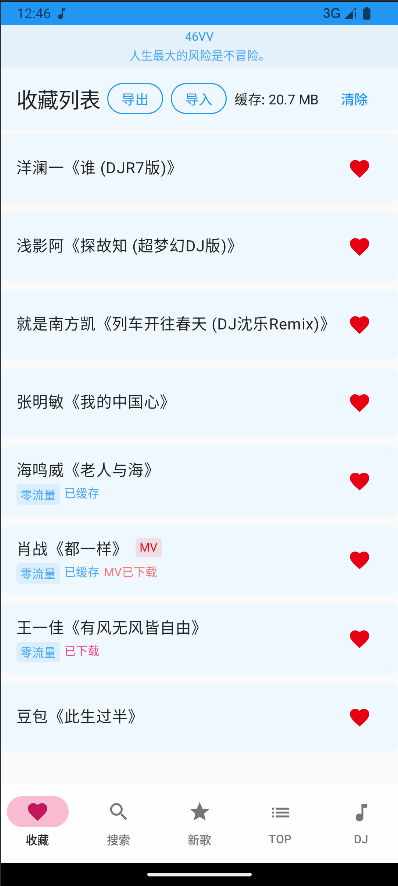
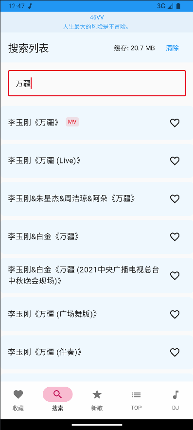
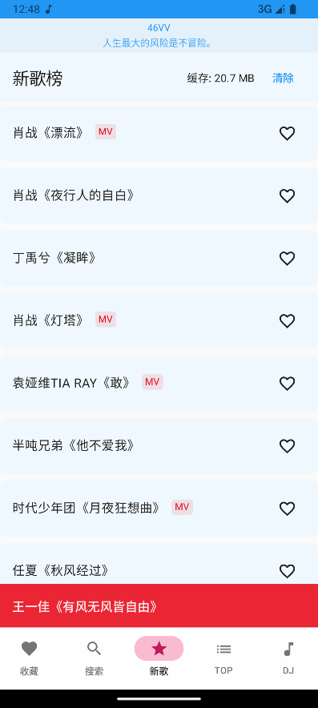

# 易听音乐

易听音乐是一款简洁的音乐播放器应用，为您提供流畅的音乐播放体验。

## 应用截图

  
  
  
  

## 主要功能

### 🎵 音乐播放
- 高品质音乐播放
- 歌词同步显示
- 后台播放支持
- 通知栏控制

### 💫 智能缓存
- 自动缓存播放过的音乐
- 支持离线播放
- 智能缓存管理
- 零流量播放模式

### 🎬 MV 支持
- 在线观看 MV
- MV 下载功能
- 高清画质支持

### ❤️ 收藏管理
- 收藏喜爱的音乐
- 导入/导出收藏列表
- 快速访问收藏

### 🔍 音乐发现
- 音乐搜索
- 新歌榜单
- TOP 排行榜
- DJ 专区

## 使用技巧

1. **零流量播放**
   - 已缓存或下载的音乐会显示"零流量"标记
   - 无需联网即可播放

2. **收藏管理**
   - 点击歌曲右侧的心形图标即可收藏
   - 在收藏页面可以导入/导出收藏列表

3. **MV 功能**
   - 带有"MV"标记的歌曲支持观看 MV
   - 可以下载 MV 到本地观看

4. **播放控制**
   - 支持列表循环、单曲循环和随机播放
   - 通知栏和锁屏界面均可控制播放

5. **缓存管理**
   - 在设置中可以查看和清理缓存
   - 支持选择性清理缓存

## 注意事项

- 建议在 WiFi 环境下下载音乐和 MV
- 定期清理不需要的缓存以节省存储空间
- 导出收藏列表可以防止数据丢失

感谢您选择易听音乐，希望能为您带来愉悦的音乐体验！ 